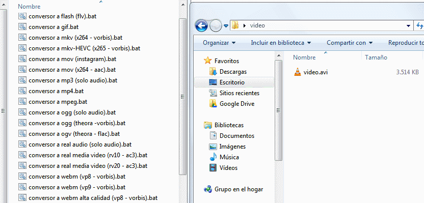

# Video (and audio) converter scripts

Easy, fast and simple method for Windows-dummies (*or lazy people*) to convert video/audio file to multiple formats with 1-step drag and drop file:

Scripts video available:

- MKV (Matroska, x264/Vorbis) H.264
- MKV (Matroska, x265/Vorbis) H.265
- FLV (Flash video) H.263
- GIF (Animated image, no sound)
- MOV (x264/Vorbis) H.264
- MOV (Instagram support) H.264
- MP4 (x264 / AAC) H.264
- MPEG (MPEG-1 / MPEG-1 P3 L2) H.261
- OGG (Theora / Vorbis)
- OGV (Theora / FLAC)
- RM (Real Video 1.0 / AC3)
- RM (Real Video 2.0 / AC3)
- WEBM (VP8 / Vorbis)
- WEBM (VP9 / Vorbis)
- WMV (Windows Media Video / Windows Media Audio)
- AVI (XviD / MP3)
- AVI (XviD / Vorbis) \*danger with sound\*

And audio:

- MP3 (MPEG-1 Audio Layer III)
- AC3 (AC-3 Dolby Digital)
- AAC (Advanced Audio Coding)
- OGG (OGG Vorbis)
- RA (Real Audio)
- WMA (Windows Media Audio)
- Opus (Opus Codec)
- FLAC (Free Lossless Audio Codec, lossless format)
- WV (WavPack, lossless format)
- WAV (Waveform, not compressed)

# Installation

- Download [master.zip](https://github.com/ManzDev/video-converter-scripts/archive/master.zip) of **video-converter-scripts**.
- Unzip on folder.
- If you have a **old PC** (32 bits), delete `ffmpeg.exe` and rename `ffmpeg.x86.exe` to `ffmpeg.exe`.
- Ready!

# Usage

Simply, drag video file to desired .bat file format.

# Notes

- This scripts use ffmpeg builds for Windows (compressed with UPX for reduce size): [http://ffmpeg.zeranoe.com/builds/](http://ffmpeg.zeranoe.com/builds/) 

- More info about formats and codecs (spanish): 
[http://www.emezeta.com/articulos/formatos-de-video-todo-lo-que-deberias-saber](http://www.emezeta.com/articulos/formatos-de-video-todo-lo-que-deberias-saber)
[http://www.emezeta.com/articulos/formatos-de-audio-todo-lo-que-deberias-saber](http://www.emezeta.com/articulos/formatos-de-audio-todo-lo-que-deberias-saber)